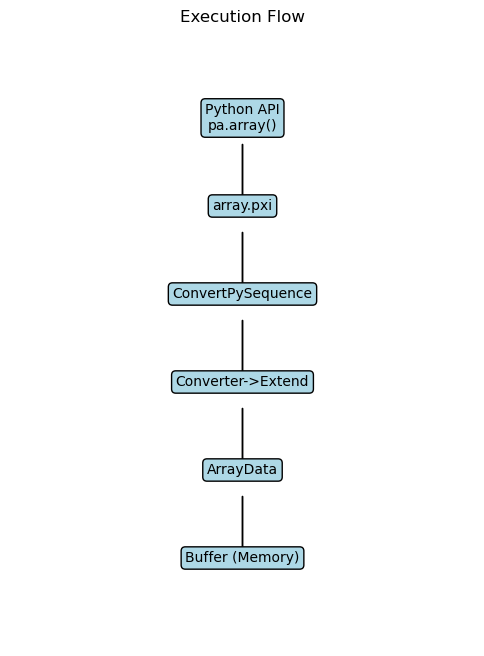

# Apache Arrow — Zero-Copy System Analysis

## What is this?
This is our end-semester systems engineering project. Instead of just using Apache Arrow as an analytics tool, we completely tore it apart. We reverse-engineered the C++ codebase, traced exactly how data moves into memory, and ran heavy Python experiments to prove how its zero-copy architecture actually works under the hood.

---

## What we wanted to figure out
- What exact problem does Apache Arrow solve?
- Is "zero-copy" actually real, and how much faster is it?
- What compromises did the developers make to get this speed?
- Where does the system eventually break or fail?

---

## How we broke it down

### Phase 1 — Tracking the Code

We tracked the exact path data takes from the top-level Python API straight down into raw C++ memory blocks (`array.pxi` -> `ConvertPySequence` -> `Buffer`).

### Phase 2 — Memory Design 

We mapped out how Arrow stores data. Everything is packed into contiguous columnar buffers. Because arrays act as "views", multiple objects can point to the exact same buffer without copying anything.

### Phase 3 — The Big Design Choices
We dug into the code and looked at 4 massive decisions the Arrow team made:
1. Columnar memory layout  
2. Buffer abstractions  
3. Using bitmaps for nulls  
4. The custom Memory Pool  

### Phase 4 & 5 — Stress Testing & Breaking It
We wrote 6 Python scripts to hammer the system. We tracked the actual physical memory addresses to prove zero-copy works, tracked the memory pool limits, and intentionally forced the system to fail and copy data.

---

## Key Takeaways

### Zero-Copy is insane

- Slicing data takes constant time (O(1)). Duplicating it scales terribly (O(n)). 
- The speed doesn't come from faster math; it comes from just never moving the data in the first place.

### But it has hard limits
*Zero-copy is not magic. If you try to convert Arrow data into a native Python list or pass it to an unsupported system, the architecture breaks and it is forced to do an expensive deep-copy.*

### Memory Pooling hoards RAM
Arrow doesn't give memory back to the OS right away. It hoards it in a pool so it can quickly reuse it later, trading higher RAM usage for much faster allocation speeds.

---

## The Hard Data from our Experiments

### Zero-Copy vs Copy
- Zero-copy time: **0.0002 seconds** (Flatline)
- Copy time: **3.6057 seconds** (Linear climb)


### The Memory Pool
- Memory scales up quickly (`arr1` = 80MB, `arr2` = 160MB).  
- But when we deleted the data in Python, Arrow kept the 80MB locked in the pool instead of freeing it.


### Breaking the System
We tracked the exact memory pointers:
- Slicing kept the same pointer (`2326838259776`).
- Converting to a standard Python `list` gave us a totally different pointer (`2327277666432`). It broke zero-copy!


### Scale Testing (1M to 50M records)
- The execution times mostly scale linearly (5M: `0.0008s` → 10M: `0.0018s` → 50M: `0.0073s`).
- However, the 1M test actually took longer (`0.0764s`) because the CPU cache had to warm up first!


### The Null Bitmap Trick
- We processed an array with Nulls (`0.3910s`) and an array without Nulls (`0.7842s`).
- Because Arrow uses a highly optimized 1-bit logic checker, handling nulls was actually *faster*.


---

## Project Structure

```text
.
├── DESIGN_DECISION/
│   └── decision.md
├── DIAGRAMS/
│   ├── execution_flow.png
│   ├── generate diagrams.py
│   ├── memory_layout.png
│   └── zero_copy_vs_copy.png
├── EXPERIMENTS/
│   ├── exp1_zero_copy_vs_copy.py
│   ├── exp2_buffer_memory_check.py
│   ├── exp3_memory_pool.py
│   ├── exp4_null_bitmap.py
│   ├── exp5_scale_test.py
│   └── exp6_break_zero_copy.py
├── MODIFIED_ARROW/
├── PRESENTATION/
├── REPORT/
│   ├── concept_mapping.md
│   ├── execution_understanding.md
│   └── failure_analysis.md
├── RESULT/
│   ├── break_zero_copy_plot.png
│   ├── genarate_plot_experiments.py
│   ├── memory_pool_plot.png
│   ├── null_bitmap_plot.png
│   ├── observations.md
│   ├── scaling_plot.png
│   └── zero_copy_vs_copy_plot.png
└── README.md
```

## Authors
Jay Patel — 202518025
Saachi Garg — 202518007

Student Project
M.Sc. Data Science — Big Data Analysis