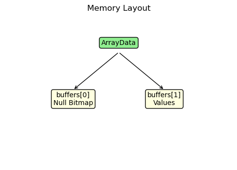
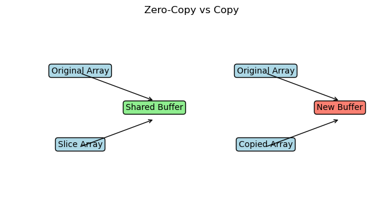

# Concept Mapping

This section maps Apache Arrow’s design and implementation to core data systems concepts covered in the course.

---

## 1. Storage Model — Columnar Storage

### Concept

Columnar storage organizes data by columns instead of rows. This improves performance for analytical workloads where operations are performed on entire columns.

**Graph Interpretation:** This layout clearly compares traditional row-based object storage against Arrow's contiguous columnar buffers, visually explaining why columnar cache locality is superior.

---

### In Apache Arrow

- Data is stored in contiguous buffers for each column  
- Implemented in:
  - `cpp/src/arrow/array/data.h`
  - buffer-based layout (`buffers[1]` stores values)

---

### Implication

- Efficient scanning and vectorized operations  
- Better cache locality  
- Reduced unnecessary data access  

---

## 2. Memory Management — Buffer Abstraction

### Concept

Efficient systems use low-level memory abstractions to manage data storage and access.

---

### In Apache Arrow

- Buffer abstraction represents raw contiguous memory  
- Implemented in:
  - `cpp/src/arrow/buffer.h`
  - `cpp/src/arrow/buffer.cc`

---

### Implication

- Enables zero-copy data sharing  
- Allows multiple arrays to reference the same memory  
- Reduces memory duplication  

---

## 3. Data Ingestion / Execution Pipeline

### Concept

Data systems process input through a pipeline: ingestion → transformation → storage.

---

### In Apache Arrow

- Python input is converted through a structured pipeline:
  - `array.pxi` → `_sequence_to_array()`  
  - `ConvertPySequence()`  
  - `MakeConverter()`  
  - `converter->Extend()`  

---

### Implication

- Clear separation between interface and execution  
- Processing happens in optimized C++ layer  
- Supports efficient data conversion  

---

## 4. Null Handling — Bitmap Representation

### Concept

Efficient systems separate metadata (such as null values) from actual data.

---

### In Apache Arrow

- Null values stored in a bitmap (1 bit per value)  
- Implemented in:
  - `cpp/src/arrow/array/data.h`
  - `buffers[0]` → null bitmap  

---

### Implication

- Memory-efficient null representation  
- Avoids polluting data buffer  
- Fast null checks using bit operations  

---

## 5. Memory Allocation — Memory Pool

### Concept

High-performance systems use custom memory allocators to reduce overhead.

---

### In Apache Arrow

- Memory managed using a memory pool  
- Implemented in:
  - `cpp/src/arrow/memory_pool.cc`

---

### Implication

- Reduces allocation overhead  
- Reuses memory blocks  
- Improves performance under repeated allocations  

---

## 6. Zero-Copy Data Sharing

### Concept

Zero-copy systems avoid data duplication by sharing memory between components.

**Graph Interpretation:** This traces how two entirely separate Array objects can execute rapid operations by pointing to the exact same physical raw byte buffer.

---

### In Apache Arrow

- Arrays share buffers instead of copying data  
- Verified through slicing (`ArrayData::Slice`)  
- Observed in experiments (shared buffer addresses)

---

### Implication

- High performance  
- Reduced memory usage  
- Efficient interoperability between systems  

---

## Summary

Apache Arrow integrates multiple system design concepts:

- Columnar storage for efficient analytics  
- Buffer abstraction for memory management  
- Pipeline-based execution for data processing  
- Bitmap-based null handling  
- Memory pooling for allocation efficiency  
- Zero-copy for performance optimization  

These concepts together enable Arrow to achieve high-performance data processing by focusing on memory layout and minimizing data movement.