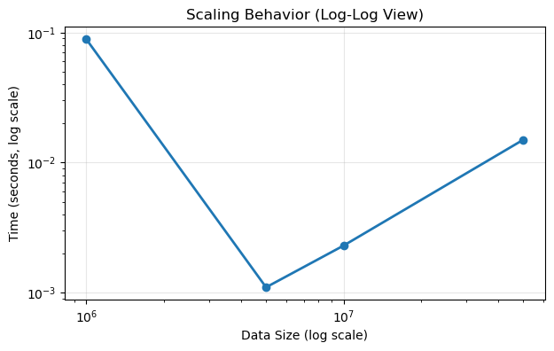
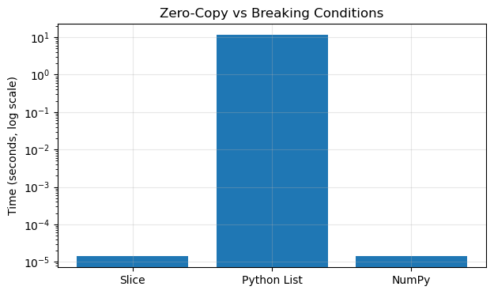
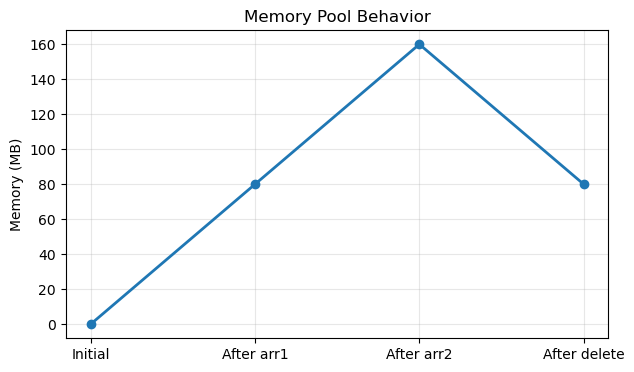

# Failure Analysis

This section analyzes how Apache Arrow behaves under different stress conditions and identifies its limitations and underlying assumptions.

---

## 1. Behavior with Increasing Data Size

### Observation

From the scaling experiments, execution time generally increases as data size grows, although not in a perfectly linear manner.

As seen in the plot, there is serious initialization friction upfront. Small datasets take a cache-warmup penalty before the hardware stabilizes into efficient, predictable linear scaling.

---

### Analysis

- Larger datasets require more memory allocation and processing time  
- However, performance is influenced by:
  - CPU caching  
  - memory reuse via memory pool  
  - runtime optimizations  

---

### Limitation

- Performance gains reduce as dataset size grows beyond cache limits  
- Memory consumption increases significantly for very large datasets  

---

### Insight

Arrow performs efficiently for large datasets, but performance depends on available memory and hardware characteristics.

---

## 2. Behavior Under Data Conversion (Breaking Zero-Copy)

### Observation

- Zero-copy works during slicing  
- Zero-copy breaks when converting to Python lists  
- NumPy conversion may or may not preserve zero-copy depending on compatibility  

  

The plot illustrates the exact failure boundary where incompatible data types force a hard copy operation, which totally breaks the zero-copy promise.

---

### Analysis

- Zero-copy relies on shared memory representation  
- Converting to Python objects forces data materialization  
- Cross-system compatibility determines whether memory can be shared  

---

### Limitation

- Zero-copy is not guaranteed across all operations  
- Performance degrades when data leaves Arrow’s memory model  

---

### Insight

Arrow is most efficient when operations remain within its internal memory representation.

---

## 3. Memory Management Limitations

### Observation

- Memory usage increases with allocations  
- Memory is not fully released after deletion  

  

The plateaus in this graph prove that the Arrow pool restricts freeing memory back to the OS. It maintains a high peak RAM usage as a tradeoff for faster reallocation speed later.

---

### Analysis

- Arrow uses a memory pool that retains memory for reuse  
- This reduces allocation overhead but keeps memory reserved  

---

### Limitation

- Higher peak memory usage  
- Memory may not be returned to the operating system immediately  

---

### Insight

Arrow trades memory efficiency for performance by reusing allocated memory.

---

## 4. Handling of Null Values

### Observation

- Performance with null values did not show expected overhead  

---

### Analysis

- Null values are stored using a bitmap, which is memory-efficient  
- Python-level overhead and data patterns influence timing results  

---

### Limitation

- Performance impact of nulls is not always predictable  
- High-level measurements may not reflect actual system cost  

---

### Insight

Arrow’s null handling is optimized, but performance evaluation requires careful interpretation.

---

## 5. System Assumptions

Apache Arrow relies on several key assumptions:

---

### Assumption 1: Sufficient Memory Availability

- Arrow stores data in-memory  
- Large datasets require significant RAM  

---

### Assumption 2: Compatible Memory Layout

- Zero-copy depends on compatible data representations  
- Works best with systems like NumPy  

---

### Assumption 3: Analytical Workloads

- Optimized for columnar access patterns  
- Not ideal for row-wise operations or frequent updates  

---

### Assumption 4: Controlled Execution Environment

- Performance depends on hardware factors such as cache and memory bandwidth  

---

## Final Conclusion

Apache Arrow is highly efficient due to its memory-centric design, but its performance depends on specific conditions:

- It performs best when data remains within Arrow’s memory model  
- Zero-copy advantages diminish when data is converted across systems  
- Memory pooling improves speed but increases memory usage  
- System performance is influenced by hardware and runtime behavior  

Understanding these limitations is essential for effectively using Arrow in real-world systems.