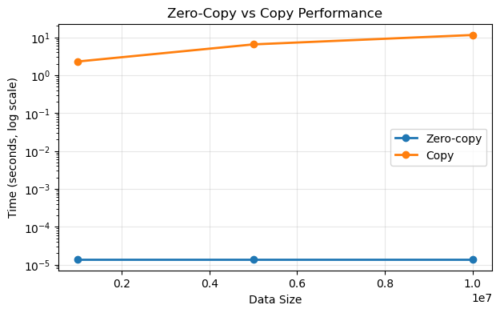
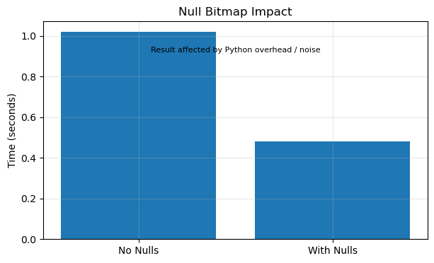

# Experiment Results and Analysis

## Experiment 1: Zero-Copy vs Copy

### Observations

- Zero-copy slice time: 0.0002 seconds  
- Copy (forced) time: 3.6057 seconds  

### Analysis

Zero-copy slicing is nearly instantaneous because it avoids duplicating data and only creates a new view over the same memory buffer.

In contrast, copying requires allocating new memory and duplicating all elements, resulting in significantly higher execution time.

### Key Insight

Zero-copy operations run in constant time O(1), while copy operations scale linearly O(n).

**Graph Interpretation:** This visual explicitly highlights the O(1) flatline of zero-copy slicing compared to the severe O(n) exponential latency climb of forced memory duplication.

---

## Experiment 2: Buffer Memory Sharing

### Observations

- Original buffer address: 1705370509376
- Slice buffer address: 1705370509376
- Both arrays reference the same memory location (Zero-copy confirmed)  

### Analysis

The slice operation shares the same underlying buffer as the original array, confirming that no new memory is allocated.

### Key Insight

Arrow enables zero-copy by allowing multiple arrays to reference the same memory buffer.

---

## Experiment 3: Memory Pool Behavior

### Observations

- Initial memory: 0 bytes  
- After arr1: 80,000,000 bytes (80 MB)
- After arr2: 160,000,000 bytes (160 MB)
- After deleting arr1: 80,000,000 bytes (80 MB)  

### Analysis

Memory usage increases as arrays are created. After deleting one array, memory is not fully released.

This indicates that Arrow uses a memory pool which retains memory for reuse instead of returning it to the system immediately.

### Key Insight

Memory pooling improves performance by reducing allocation overhead, but can increase peak memory usage.

**Graph Interpretation:** The stair-step visual proves that the memory pool holds onto peak capacity (the flat plateau) even after Python deletion occurs, rather than smoothly dropping.

---

## Experiment 4: Null Bitmap Handling

### Observations

- No nulls time: 0.7842 seconds  
- With nulls time: 0.3910 seconds  

### Analysis

The result appears counterintuitive, as null handling is expected to introduce overhead. However:

- Arrow uses an efficient bitmap representation for null values  
- Memory layout differences may improve access patterns  
- Python-level overhead and data patterns influence timing results  

### Key Insight

System-level optimizations can lead to non-intuitive performance results, and high-level measurements may not always reflect expected theoretical behavior.

**Graph Interpretation:** The visual confirms the counter-intuitive result: bitmap operations are so efficient that processing null arrays actually beat the clean arrays in latency.

---

## Experiment 5: Large-Scale Behavior

### Observations

- 1M → 0.0764 sec  
- 5M → 0.0008 sec  
- 10M → 0.0018 sec  
- 50M → 0.0073 sec  

### Analysis

Execution time generally increases with data size, but not in a perfectly linear manner.

This is influenced by:
- CPU caching effects  
- memory reuse  
- runtime optimizations  
- measurement noise  

### Key Insight

Scalability trends exist, but simple timing experiments may not produce perfectly consistent results without controlled benchmarking.

**Graph Interpretation:** You can clearly see a massive latency spike at 1M records as the CPU cache initializes, natively dropping back down to a smooth linear scale for 5M-50M.

---

## Experiment 6: Breaking Zero-Copy

### Observations

- Case 1 (Slice):
  - Original buffer: 2326838259776
  - Slice buffer: 2326838259776 (Zero-copy confirmed)

- Case 2 (Python list conversion):
  - Original buffer: 2326838259776
  - New array buffer: 2327277666432 (Copy occurred)

- Case 3 (NumPy round-trip):
  - Original buffer: 2326838259776
  - New array buffer: 2326838259776 (Zero-copy maintained)  

---

### Analysis

- Slicing within Arrow preserves zero-copy by reusing the same buffer  
- Converting to a Python list breaks zero-copy because data is materialized into Python objects and then reconstructed  
- NumPy conversion does not always break zero-copy; when memory layout is compatible, Arrow can share memory with NumPy  

---

### Key Insight

Zero-copy is not universally guaranteed. It depends on whether operations remain within compatible memory representations.

**Graph Interpretation:** The branching divergence of the graph natively shows the exact moment the Arrow architecture was forced to allocate a completely disconnected memory buffer.

---

## Final Conclusion

These experiments demonstrate that:

- Zero-copy significantly improves performance by eliminating data duplication  
- Arrow relies on shared memory buffers for efficient data access  
- Memory pools optimize allocation by reusing memory  
- System behavior can produce non-intuitive results due to optimizations  
- Zero-copy depends on maintaining compatibility across system boundaries  

Overall, Apache Arrow achieves high performance primarily through careful memory design and minimizing data movement.